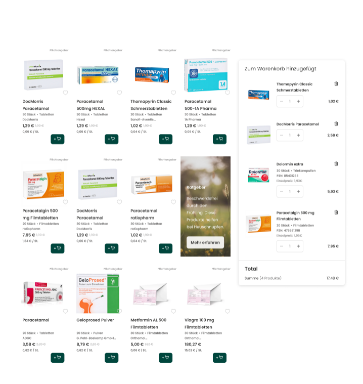
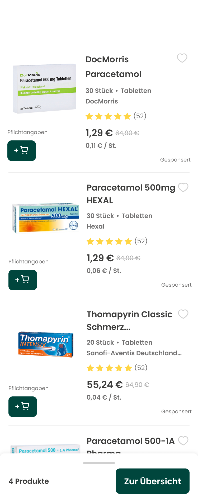
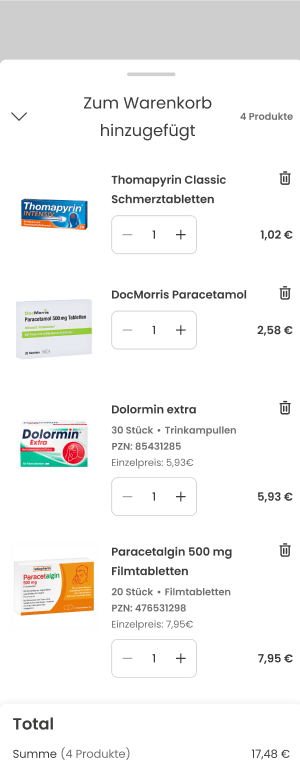

# Shopping Cart Feature

## Overview
This project is a code challenge involving the development of a responsive shopping cart application built using **React** and **TypeScript**. It demonstrates a dynamic product listing and shopping cart functionality, allowing users to add and remove products from the cart. The application fetches product data from a local JSON file and updates the product list and total cost dynamically based on user interactions.

### Requirements

As part of this challenge, several requirements have been addressed. <br> 
To highlight progress, the following icons are used: ✅ **Achieved** and 🔨 **Pending/In Progress**.

#### **General Requirements**
- ✅ The codebase is written in TypeScript and follows a modular approach.
- 🔨 Each component will have accompanying unit tests.
- ✅ Efficient resource use and performance optimization are implemented.
- ✅ Functionality is prioritized over aesthetic precision.

#### **Additional Points of Interest**
- ✅ **State management:** Managed using React hooks.
- ✅ **Performance optimization:** Popups are optimized for performance.
- ✅ **Mobile-first development:** Responsive design implemented.
- ✅ **Code simplicity and readability:** SOLID principles are followed.
- ✅ **Component design:** Components are well-structured and modular.
- ✅ **Error handling:** Implemented to catch and manage potential issues.
- ✅ **Testing:** Using React Testing Library and Jest.
- 🔨 **Accessibility:** Accessibility improvements are ongoing.
- ✅ **External libraries:** Utilized libraries like `react-modal` for better UX.
- ✅ **Project setup:** Fully configured for smooth development and testing.

## Features

- **Product Listing**: Displays a dynamic list of products fetched from a local JSON file. Users can add products to the cart until stock runs out.
- **Shopping Cart**: Shows products added to the cart, total quantity, and total cost. Users can also remove products from the cart.
- **Responsive Design**: Optimized for mobile and desktop views. On mobile, the cart is displayed as a sticky section at the bottom, showing only the total cost and quantity.
- **TypeScript Support**: The entire project is fully typed with TypeScript, ensuring better code quality and maintainability.
- **Testing**: Includes unit tests for core functionalities to ensure reliability.

## Mockup
A mockup has been provided through Figma, a collaborative design tool for building meaningful products. Check the online design by clicking [here](https://www.figma.com/design/L0q8d0GTEpfV1pt2qSFLsH/Mockup?node-id=1-13494&node-type=FRAME&t=B3E34bAKFSE7LHxa-0)<br>

### Desktop Design



### Mobile Product List Design<br>


### Mobile Cart Design<br>


## Technologies Used

- **HTML5**: The standard language for creating web pages.
- **CSS3**: Cascading Style Sheets are used for styling web pages.
- **JavaScript (ES6+)**: The core programming language for adding interactivity to web applications.
- **React**: A JavaScript library for building user interfaces.
- **TypeScript**: A typed superset of JavaScript that compiles to plain JavaScript.
- **Node.js & npm**: Node.js is used to run JavaScript outside the browser, while npm (Node Package Manager) is used to manage dependencies and scripts for the project. This project uses npm for installing packages and running development tasks such as building and testing the application.
- **Jest & React Testing Library**: Used for writing and running unit tests.
- **Git**: Version control system used to track changes in the project. 
- **GitHub**: A platform used to store the project's source code, manage issues, and facilitate collaboration with other developers.
- **Visual Studio Code**: The primary code editor used for development.


<h3 align="left">Languages and Tools:</h3>
<p align="left"> <a href="https://www.w3.org/html/" target="_blank" rel="noreferrer">  </a> 
<a href="https://www.w3schools.com/css/" target="_blank" rel="noreferrer">  </a> 
<a href="https://developer.mozilla.org/en-US/docs/Web/JavaScript" target="_blank" rel="noreferrer">  </a> 
<a href="https://reactjs.org/" target="_blank" rel="noreferrer">  </a> 
<a href="https://www.typescriptlang.org/" target="_blank" rel="noreferrer">  </a> 
<a href="https://nodejs.org" target="_blank" rel="noreferrer">  </a> 
<a href="https://jestjs.io" target="_blank" rel="noreferrer">  </a> 
<a href="https://git-scm.com/" target="_blank" rel="noreferrer">  </a> </p>

## Installation

Follow these steps to get a local copy of the project running:

### Clone the repository:

1. Open your bash and navigate to the location where you want to create your project and execute:<br> 
```git clone https://github.com/your-username/shopping-cart.git```

2. Navigate into the project directory:<br> 
```cd shopping-cart```

3. Install the dependencies executing:<br> 
```npm install```

4. Run the project:<br> 
```npm start```
<br> 
This command will run the app in development mode. Open http://localhost:3000 to view it in your browser.<br> 

The page will automatically reload if you make edits. You will also see any lint errors in the console.


### API
The application uses a mock API to fetch product data from a JSON file. The products.json file is located in the public directory and contains an array of product objects.

### Testing
To run the unit tests, use the following command:<br> 
```npm test```<br><br> 
This command will run Jest in watch mode and execute all test files matching the *.test.tsx pattern.

### Contributing

Contributions are welcome! If you have suggestions or improvements, feel free to submit a pull request. To contribute:

### License
This project is open-source and available under the MIT License.

### Contact

For questions or feedback, feel free to reach out:

- **LinkedIn**: [linkedin.com/in/irisleo/](https://www.linkedin.com/in/irisleo/)
- **Email**: [irisleo.com@gmail.com](mailto:irisleo.com@gmail.com)

If you encounter any issues or have suggestions for improvement, please feel free to submit a GitHub issue or create a pull request.

---

Thank you for checking out this project! Feel free to contribute or share feedback to help improve the project.
